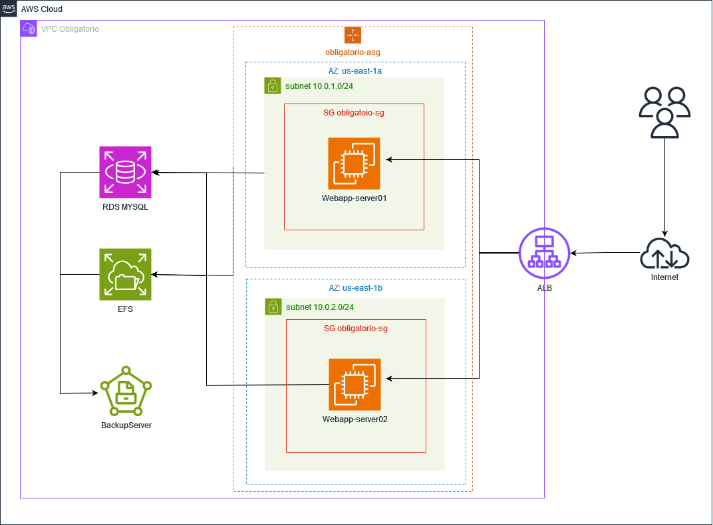

# Obligatorio Soluciones Cloud

- [Introducción](#Introducción)
- [Diagrama](#diagrama)
- [Requerimientos](#requerimientos)
- [Despliegue](#despliegue)
- [Descripción](#descripción)
- [Backup](#backup)
- [Providers](#providers)
- [Resources](#resources)
- [Inputs](#inputs)

## Introducción

Este repo contiene el código en terraform necesario para desplegar la infraestructura en AWS solicitada en el obligatorio de soluciones cloud.
Descripción de la Arquitectura:
- Un LoadBalancer HTTP/S
- Dos servidores Web
- Una base de datos relacional
- Un servidor donde se almacenan documentos estáticos
- Un servidor de backup con persistencia

## Diagrama

El siguiente diagrama representa la infraestructura planteada para la resolución del trabajo obligatorio de soluciones cloud. La misma consta de un application load balancer que atiende las consultas de los usuarios provenientes de internet y las balancea entre dos instancias ec2 que brindan el servicio de web server, desplegadas mediante auto scaling group en zonas de disponibilidad distintas para lograr redundancia y alta disponibilidad. A su vez estas instancias consumen los servicios de RDS (base de datos) y EFS (almacenamiento de archivos) para el funcionamiento de la web app. También se desplego una instancia ec2 que oficia de servidor de backup, todos estos componentes viven dentro de un mismo VPC.

 

## Requerimientos

- [AWS CLI](https://docs.aws.amazon.com/cli/latest/userguide/getting-started-install.html)
- [Terraform](https://developer.hashicorp.com/terraform/tutorials/aws-get-started/install-cli)
- [Git](https://github.com/git-guides/install-git)

## Despliegue

- Clonar el repo localmente 
- Editar en el archivo `obligatorio_vars.tfvars` con los valores para las variables
- Configurar las credenciales de AWS en el archivo `credentials`
- Inicializar el directorio de trabajo con `terraform init`
- Ejecutar el codigo con `terraform apply -var-file="obligatorio_vars.tfvars"`

## Descripción

Esta infraestructura como código creada en Terraform está dividida en distintos archivos `.tf`, cada uno correspondiente a un recurso o grupo de recursos en común de AWS y un archivo `.tfvars` donde se carga el valor para las variables definidas. Explicaremos brevemente la función de cada archivo y los puntos importantes de cada uno.

### `alb.tf`

Este archivo contiene el código para desplegar el `Application Load Balancer`. Dentro del mismo se define los listener, target group y se asocia el security group correspondiente para permitir el acceso.

### `asg.tf`

Este archivo contiene el código para desplegar el `Auto Scaling Group`. ASG nos permite el despliegue automático de instancias para tener alta disponibilidad. Definimos un `launch configuration` con el tipo de instancia, ami, key y utilizamos el user-data que nos permite ejecutar personalizaciones al momento del despliegue de las instancias para crear variables de entorno, por ejemplo la clave de la base de datos para no tener que dejarla escrita en el código. También descargamos y ejecutamos un script de despliegue con todo lo necesario para levantar la app web.

### `efs.tf`

Este archivo contiene el código para desplegar el servicio de archivos `EFS`. Dentro del mismo se define los mount target que son desde qué redes se va a poder montar por NFS dicho servicio y se asocia el security group correspondiente para permitir el acceso.

### `instancias.tf`

Este archivo contiene el código para desplegar la instancia de backup. Dentro del mismo se definen cosas básicas como la AMI, subred, SG, etc. Lo particular en nuestro caso es la personalización que realizamos dentro del sistema operativo de la instancia con el provisioner “remote-exec”. Con este provisioner podemos ejecutar comandos del sistema operativo una vez que la instancia está levantada.

En el caso de la instancia para backups, con el `remote-exec` realizamos los siguientes puntos:

- Montaje de nuevo disco persistente para alojar los backups.
- Montaje del servicio EFS.
- Copiamos el script de backup desde el PC donde ejecutamos Terraform hacia la instancia. Este script realiza una copia desde el EFS hacia el disco para backups, creando una carpeta por día y manteniendo las últimas 7.
- Programamos en cron para que se ejecute el script todos los días a las 23hs.
- Reiniciamos servicios.

### `networking.tf`

Este archivo contiene el código para desplegar todos los componentes de red que se van a utilizar. En el mismo se define:

- VPC
- Subnet
- Internet Gateway
- Routing Table
- Security Group

### `provider.tf`

En este archivo se especifican los provider a utilizar en el código de Terraform. En nuestro caso, estamos utilizando solo el de `AWS`.

### `rds.tf`

Este archivo contiene el código para desplegar el servicio de bases de datos `RDS` de AWS. Se define el motor de base de datos a utilizar (MySQL) y la versión 5.7.44. También se especifica que se realice backup de la misma con un periodo de retención definido en la variable `retention_period`.

### `variables.tf`

En este archivo se definen todas las variables a utilizar en el código de Terraform. Se define el nombre, el tipo y el valor por defecto que puede tener o no.

## Backup

Contamos con respaldo a nivel de la base de datos y con respaldo de las imágenes de la app que se encuentran en el servicio de EFS. Para el respaldo de la base de datos se utiliza el servicio de snapshot propio de RDS, el mismo se configura al despliegue y se le puede especificar los días de retención mediante la variable “retention_period”. Para el respaldo de las imágenes alojadas en EFS se desplego una instancia `EC2` la cual monta el servicio de `EFS` y mediante un script que se ejecuta mediante cron realiza una copia hacia un volumen persistente de la instancia y realizar una retención de 7 días. Dicha retención se puede editar en el script `backup.sh` y la ejecución del mismo se puede editar en el `remote-exec` de la instancia de backup donde se configura el cron.

## Providers

| Name | Version |
|------|---------|
|  [aws](#provider\_aws) | 5.52.0 |

## Resources

| Name | Type |
|------|------|
| [aws_autoscaling_group.obligatorio-asg](https://registry.terraform.io/providers/hashicorp/aws/latest/docs/resources/autoscaling_group) | resource |
| [aws_db_instance.obligatorio-rds](https://registry.terraform.io/providers/hashicorp/aws/latest/docs/resources/db_instance) | resource |
| [aws_db_subnet_group.network-group-obligatorio](https://registry.terraform.io/providers/hashicorp/aws/latest/docs/resources/db_subnet_group) | resource |
| [aws_efs_file_system.obligatorio-efs](https://registry.terraform.io/providers/hashicorp/aws/latest/docs/resources/efs_file_system) | resource |
| [aws_efs_mount_target.obligatorio-efs-mount-tgA](https://registry.terraform.io/providers/hashicorp/aws/latest/docs/resources/efs_mount_target) | resource |
| [aws_efs_mount_target.obligatorio-efs-mount-tgB](https://registry.terraform.io/providers/hashicorp/aws/latest/docs/resources/efs_mount_target) | resource |
| [aws_instance.backup-server](https://registry.terraform.io/providers/hashicorp/aws/latest/docs/resources/instance) | resource |
| [aws_internet_gateway.obligatorio-ig](https://registry.terraform.io/providers/hashicorp/aws/latest/docs/resources/internet_gateway) | resource |
| [aws_launch_configuration.obligatorio-launch-config](https://registry.terraform.io/providers/hashicorp/aws/latest/docs/resources/launch_configuration) | resource |
| [aws_lb.alb-obligatorio](https://registry.terraform.io/providers/hashicorp/aws/latest/docs/resources/lb) | resource |
| [aws_lb_listener.my_alb_listener](https://registry.terraform.io/providers/hashicorp/aws/latest/docs/resources/lb_listener) | resource |
| [aws_lb_target_group.target_group](https://registry.terraform.io/providers/hashicorp/aws/latest/docs/resources/lb_target_group) | resource |
| [aws_route_table.obligatorio-rt](https://registry.terraform.io/providers/hashicorp/aws/latest/docs/resources/route_table) | resource |
| [aws_route_table_association.subneta](https://registry.terraform.io/providers/hashicorp/aws/latest/docs/resources/route_table_association) | resource |
| [aws_route_table_association.subnetb](https://registry.terraform.io/providers/hashicorp/aws/latest/docs/resources/route_table_association) | resource |
| [aws_security_group.obligatorio-sg](https://registry.terraform.io/providers/hashicorp/aws/latest/docs/resources/security_group) | resource |
| [aws_security_group.obligatorio-sg-EFS](https://registry.terraform.io/providers/hashicorp/aws/latest/docs/resources/security_group) | resource |
| [aws_security_group.obligatorio-sg-RDS](https://registry.terraform.io/providers/hashicorp/aws/latest/docs/resources/security_group) | resource |
| [aws_subnet.obligatorio-tf-subnet-a](https://registry.terraform.io/providers/hashicorp/aws/latest/docs/resources/subnet) | resource |
| [aws_subnet.obligatorio-tf-subnet-b](https://registry.terraform.io/providers/hashicorp/aws/latest/docs/resources/subnet) | resource |
| [aws_vpc.obligatorio-vpc](https://registry.terraform.io/providers/hashicorp/aws/latest/docs/resources/vpc) | resource |

## Inputs

| Name | Description | Type | Default | Required |
|------|-------------|------|---------|:--------:|
|  [DB\_DATABASE](#input\_DB\_DATABASE) | Variable para nombre de la base | `string` | n/a | yes |
|  [DB\_PASSWORD](#input\_DB\_PASSWORD) | Variable para Password RDS | `string` | n/a | yes |
|  [DB\_USER](#input\_DB\_USER) | Variable para usuario RDS | `string` | n/a | yes |
|  [instance\_ami](#input\_instance\_ami) | Variable para especificar la AMI | `string` | n/a | yes |
|  [instance\_type\_name](#input\_instance\_type\_name) | Variable para especificar el tipo de instancia | `string` | n/a | yes |
|  [private\_key\_name](#input\_private\_key\_name) | Variable para especificar el nombre a private key, ej. private | `string` | n/a | yes |
|  [private\_key\_path](#input\_private\_key\_path) | Variable para especificar la ruta a la private key, ej. /home/private.pem | `string` | n/a | yes |
|  [private\_subnet\_a](#input\_private\_subnet\_a) | Variable para la subnet az-a | `string` | n/a | yes |
|  [private\_subnet\_b](#input\_private\_subnet\_b) | Variable para la subnet az-b | `string` | n/a | yes |
|  [retention\_period](#input\_retention\_period) | Variable para especificar la cantidad de dias de retencion de los snapshot en RDS | `number` | n/a | yes |
|  [script\_path](#input\_script\_path) | Variable para especificar la ruta al script de backup, ej. /home/script.sh | `string` | n/a | yes |
|  [vpc\_aws\_az-a](#input\_vpc\_aws\_az-a) | Variable para la zona az-a | `string` | n/a | yes |
|  [vpc\_aws\_az-b](#input\_vpc\_aws\_az-b) | Variable para la zona az-b | `string` | n/a | yes |
|  [vpc\_cidr](#input\_vpc\_cidr) | Variable para el CIDR block | `string` | n/a | yes |
